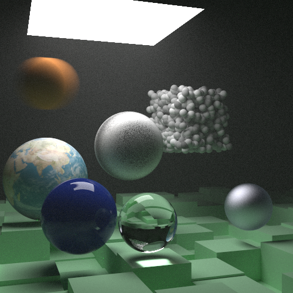

---
hide:
  - toc
---

# Code

My [github profile][0] contains the a near exhaustive list of code that I have developed throughout my years. The following
list the most completed code projects that you may find interesting.

## raytracing_in_rust

A [path tracer][1] based on Peter Shirleys books. I tried to take the end of the third book as a jumping off point for learning
more about Rust and various quality of life improvements and performance enhancements. I added a UI with egui and increased
performance with ultraviolet and rayon. I removed all of the smart pointers, dynamic dispatches and recursive rendering,
replacing them with dependency injection of services and using indices, enums for handling structs implementing an interface
and recursion was replaced by a loop based on pbrt's render loop. Additionally, I added subpixel sampling, as a form of
stratification, based on smallpt. Ultimately, as I wanted to implement more advanced topics, the overly paedagogical
architecture from Peter Shirleys books proved to be hard to continue to adapt without massive changes.

[0]: https://www.github.com/absorensen
[1]: https://github.com/absorensen/raytracing_in_rust
