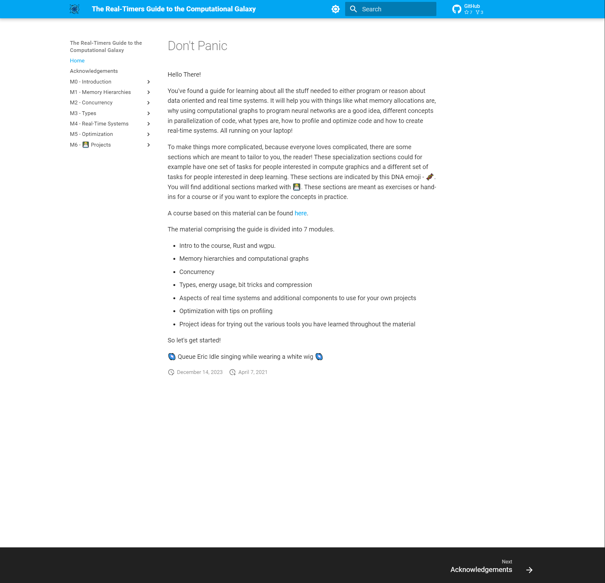
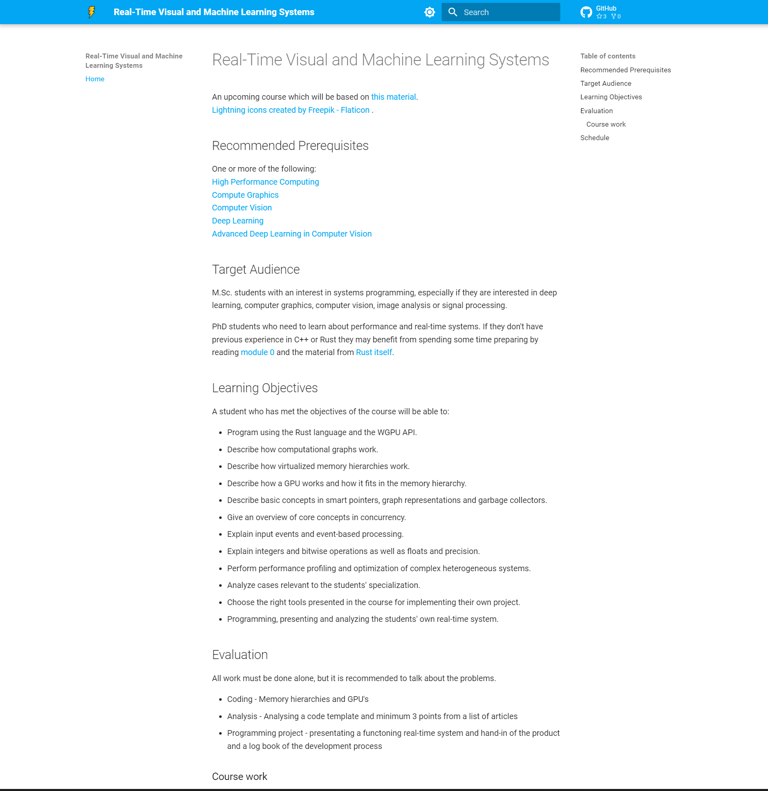

---
hide:
  - navigation
  - toc
---

# Teaching

I thoroughly enjoy teaching and have been fortunate enough to spend a bit of time on it beyond
being a teaching assistant.

## The Real-Timers Guide to the Computational Galaxy

{ width="400"}

While working at an AI research center I wrote an [online guide][0] developed for
teaching machine learners about performance. While developed for machine learners,
the guide describes universal topics like memory hierarchies, GPU programming,
concurrency, types and systems analysis. It is based around the paedagogical principles of
minimizing cognitive load and formulas, an informally written voice and encouraging play.
Framing the question of performance through the lens of real-time systems can be very
informative. If you are used to programming machine learning, whether your code is fast or slow
isn't very intuitive. Is my model fast if it takes 18 hours to train? Maybe? Real-time systems
on the other hand have an intuitive feedback mechanism. If the screen's update speed doesn't
match how fast you move the mouse or press the keyboard, you automatically want to make it go
faster. The material was designed technically in a way where all users can run the code locally
as easily as possible with almost no time spent on installation and it can run on almost
all GPU's. The languages used are primarily Rust, WGSL (through WGPU).

## Real-Time Visual and Machine Learning Systems

{ width="400"}

I taught from "The Real-Timers Guide to the Computational Galaxy" as a special [PhD course][1]
at the end of 2023. 2.5 ECTS points were used on lectures and going through the guide, along
with 2 hand-ins in GPGPU programming and analysis. The last 2.5 ECTS points were used for the
students trying their hand at writing their own interactive real-time system.

[0]: https://absorensen.github.io/the-guide/
[1]: https://absorensen.github.io/real-time-visual-and-machine-learning-systems/
